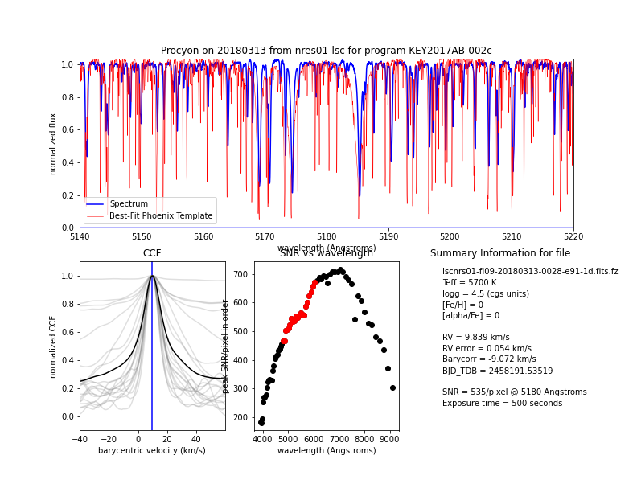
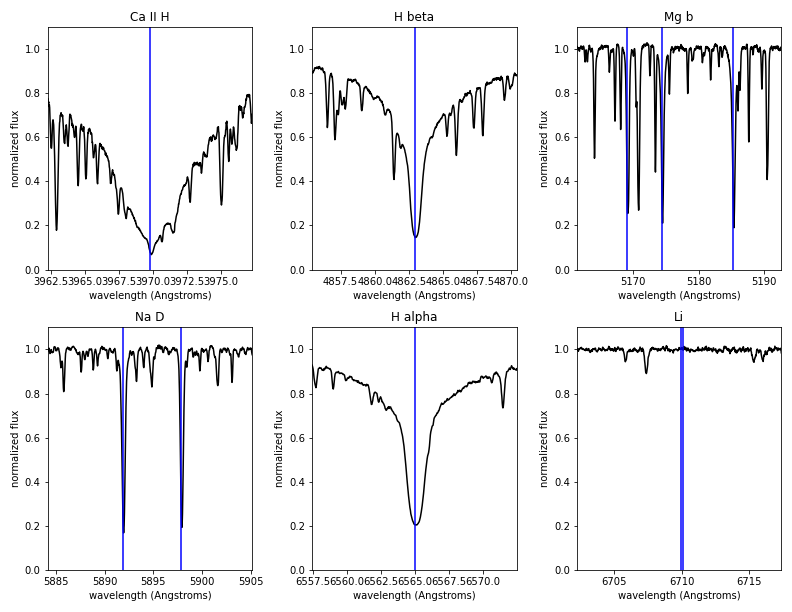

Data Products
*************
All data products produced by BANZAI-NRES are available to users. We produce 3 separate files per science observation
to minimize the bandwidth necessary for our users. All products are available from the normal
`LCO Archive <https://archive.lco.global>`_.

Preview PDFs
~~~~~~~~~~~~
For quick look information about an observation, we provide a summary PDF of the observation showing a few
important regions of the spectrum. These are primarily aimed to be diagnostic plots of the observation
quality. An example of the pages are below.

.. image:: PDF_summary_mockup3.png
    :width: 792px
    :height: 612px

Extracted Spectra
~~~~~~~~~~~~~~~~~
The primary data products we provide are the 1-D extracted wavelength-calibrated spectra. These spectra are stored in a FITS
binary table. As such they are in extension 1 of the FITS file. The extension is also named SPECTRUM for
easy access. The columns included in the table are below:

- 'id': Integer ID of the trace in this row. This corresponds to the number in the TRACE extension of the 2-D
  calibration products.

- 'order': Physical dispersion order of this trace.

- 'fiber': Fiber ID. The calibration fiber is always 1. The science fiber is either 0 or 2. The science fiber on the
  target can be determined from the 'OBJECTS' keyword in the header.

- 'wavelength': Wavelength per pixel for this trace (Angstroms).

- 'flux': Extracted flux (counts). No blaze correction or continuum normalization is performed on this data.

- 'uncertainty': Formal uncertainty of the extracted flux propagated from the previous processing stages.
  No blaze correction or continuum normalization is performed on this data.

- 'blaze': Extracted estimate of the blaze function from the quartz lamp flat field.

- 'blaze_error': Formal uncertainties on the blaze due to the Poisson statistics in the quartz lamp flat field.

- 'mask': Bad pixels have values greater than zero.

- 'normflux': Extracted flux after the blaze and continuum have been divided out.

- 'normuncertainty': Formal uncertainty of the extracted pixels after scaling by the blaze and continuum.

Results from the cross correlation are stored in the 'CCF' FITS binary table extension. The columns are:

- 'order': Physical dispersion order of this trace. This maps to the 'order' column in the 'SPECTRUM' extension.

- 'v': Velocity (km / s).

- 'xcor': Cross correlation value.

2-D Spectroscopic Frames
~~~~~~~~~~~~~~~~~~~~~~~~
We provide the full 2-D frames that have not been extracted for users who wish to perform advanced analysis
on their data. These files are much larger than the extracted spectra so are provided as a separate FITS file.
Each extension is named, so we recommend accessing the data by name so that any analysis code is insensitive
to order changes in the FITS files. A list of extension names and a description of their contents are below.

- 'SPECTRUM': 2-D non-extracted image after subtracting the bias and dark frames

- 'ERROR': 2-D frame of the of formal uncertainties including the read noise, Poisson contribution, the bias subtraction,
  and the dark subtraction

- 'BPM': Bad pixel mask (unsigned 8-bit integer). BPM = 1 for known bad pixels. BPM = 2 for saturated pixels.

- 'EXPOSURE_METER', 'AGU_1', 'AGU_2', 'TELESCOPE_1', and 'TELESCOPE_2': Exposure meter data, AGU information,
  and telescope information all direct copies from the raw data. See raw data documentation for more explanation
  on these extensions.

The rest of the data necessary for NRES data processing are stored in super-calibration frames that were used
to process this data and are described below.

Calibration files
-----------------
Stacked bias and dark frames are available via the LCO archive.

Bad pixels masks
~~~~~~~~~~~~~~~~
Masks with known bad pixels are available in the archive under OBSTYPE=BPM. Non-zero values are bad pixels.

Line List
~~~~~~~~~
The line list we use for wavelength calibration is available via the LCO archive as OBSTYPE=LINELIST.

Lamp Flats
~~~~~~~~~~
We take a series of quartz lamp flat fields to measure the positions of the traces on the CCD and to
estimate the profile. These files have the following extensions:

- 'SPECTRUM': 2-D stacked frame of the lamp flat spectrum after bias and dark subtraction and
  dividing out the profile and blaze.

- 'ERROR': Formal uncertainties on the stacked quartz lamp flats after bias and dark subtraction and
  dividing out the profile and blaze.

- 'TRACES': Integer mask with the extraction regions. Each value corresponds to the 'id' column in the extracted
  data product. :code:`banzai_nres.utils.trace_utils.get_trace_region` is a useful method to get the numpy slice
  corresponding to a given trace region.

- 'BLAZE': FITS Binary table with the estimate of the 'blaze' and 'blaze_error' from the stacked lamp flat. 'id'
  values correspond to the regions in the 'TRACE' extension.

- 'PROFILE': Profile estimate from the stacked lamp flat. Non-zero only where the 'TRACE' extension is non-zero.
  The profile is normalized so the sum in each column of each trace is unity. This extension is compressed, but it is compressed using the GZip algorithm instead of RICE compression like most
  of the rest of the image extensions produced by LCO, because GZip is lossless.

- 'WEIGHTS': 2-D frame of optimal extraction weights based on the profile extension described above. Using the
  :code:`get_trace_region` method can be used to easily reapply these weights and sum to produce an extraction.

ThAr Arc Lamps
~~~~~~~~~~~~~~
- 'SPECTRUM': 2-D stacked frame of the ThAr arc lamp spectrum after bias and dark subtraction,
  used for the wavelength solution.

- 'ERROR': Formal uncertainty on the 2-D stacked frame of the ThAr arc lamp spectrum after bias and dark subtraction.

- 'FEATURES': FITS binary table with the centroids of the detected features in the stacked ThAr arc lamp frames.
  These features are used to fit the wavelength solution. The pixel positions are stored in the 'x' and 'y' columns.
  The 'flux' and 'fluxerror' columns store the brightness of the features. The error on the centroid is stored in
  the 'centroid_error' column. The 'traceid' column corresponds to the value in the 'TRACES' extension of the
  stacked quartz lamp flat.

- 'WAVELENGTH': 2-D frame of the wavelength model evaluated at the center of every pixel in Angstroms.
  This extension is compressed, but it is compressed using the GZip algorithm instead of RICE compression like most
  of the rest of the image extensions produced by LCO, because GZip is lossless.

.. include:: idl-differences-data-products.rst
