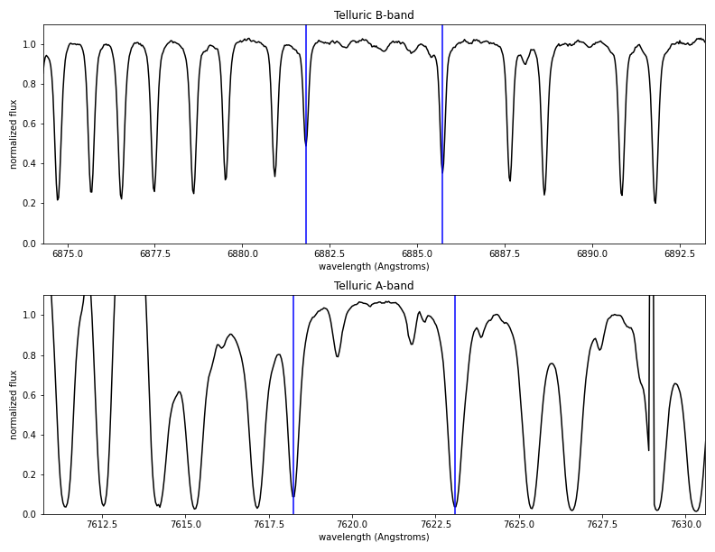

Data Products
*************
All data products produced by BANZAI-NRES are available to users. We produce 3 separate files per science observation
to minimize the bandwidth necessary for our users. All products are available from the normal
`LCO Archive <https://archive.lco.global>`_.

Preview PDFs
~~~~~~~~~~~~
For quick look information about an observation, we provide a summary PDF of the observation showing a few
important regions of the spectrum. These are primarily aimed to be diagnostic plots of the observation
quality. An example of the pages are below.

.. image:: PDF_summary_mockup1.png
    :width: 792px
    :height: 612px

.. image:: PDF_summary_mockup2.png
    :width: 792px
    :height: 612px

Extracted Spectra
~~~~~~~~~~~~~~~~~
The primary data products we provide are the 1-D extracted spectra. These spectra are stored in a FITS
binary table. As such they are in extension 1 of the FITS file. The extension is also named SPECTRUM for
easy access.

    name = 'id'; format = 'K'
    name = 'order'; format = 'K'
    name = 'fiber'; format = 'K'
    name = 'wavelength'; format = '4096D'; dim = '(4096)'
    name = 'flux'; format = '4096D'; dim = '(4096)'
    name = 'uncertainty'; format = '4096D'; dim = '(4096)'
    name = 'blaze'; format = '4096D'; dim = '(4096)'
    name = 'blaze_error'; format = '4096D'; dim = '(4096)'
    name = 'mask'; format = '4096B'; dim = '(4096)'
    name = 'normflux'; format = '4096D'; dim = '(4096)'
    name = 'normuncertainty'; format = '4096D'; dim = '(4096)'

CCF

 name = 'order'; format = 'K'
    name = 'v'; format = '7997D'; dim = '(7997)'
    name = 'xcor'; format = '7997D'; dim = '(7997)'

2-D Spectroscopic Frames
~~~~~~~~~~~~~~~~~~~~~~~~
We provide the full 2-D frames that have not been extracted for users who wish to perform advanced analysis
on their data. These files are much larger than the extracted spectra so are split into separate FITS files.
Each extension is named, so we recommend accessing the data by name so that any analysis code is insensitive
to order changes in the FITS files. A list of extension names and a description of their contents are below.

- SPECTRUM:

- ERR:

- BACKGROUND:

- EXPOSURE_METER exposure meter time series (BinTable)

- AGU_1 data on AGU 1 (BinTable)

- AGU_2 data on AGU 2 (BinTable)

- TELESCOPE_1 data on telescope 1 (CompImage)

- TELESCOPE_2 data on telescope 2 (CompImage)

The rest of the data necessary for NRES data processing are stored in super-calibration frames that

Header
1
SPECTRUM 2d spectrum (CompImage)
2
BPM bad pixel mask (CompImage)
3
ERR uncertainty on spectrum (CompImage)
4
TRACES Traces for 2d spectrum (CompImage)
5
PROFILE Profile for 2d spectrum (CompImage)
6
WAVELENGTH Wavelength solution for 2d spectrum (CompImage)
7
BACKGROUND background for 2d spectrum (CompImage)
8
WEIGHTS Optimal extraction weights for 2d spectrum (CompImage)
9
1DSPEC extracted and flat-fielded 1d spectrum (BinTable)
10

Calibration files
-----------------

Bad pixels masks
~~~~~~~~~~~~~~~~

Lamp Flats
~~~~~~~~~~

ThAr Arc Lamps
~~~~~~~~~~~~~~

.. include:: idl-differences-data-products.rst

